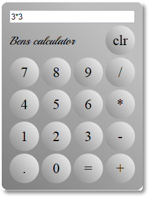

calculator
==========

Started by parsing simple numeric expressions where numbers could only be a single digit eg 1+2+3.
Modified parsing to allow spaces between numbers and operators.
Modified to allow parsing of multidigit numbers.
First use of constructor function to create calculator "class".
Created user interface and styled using css.